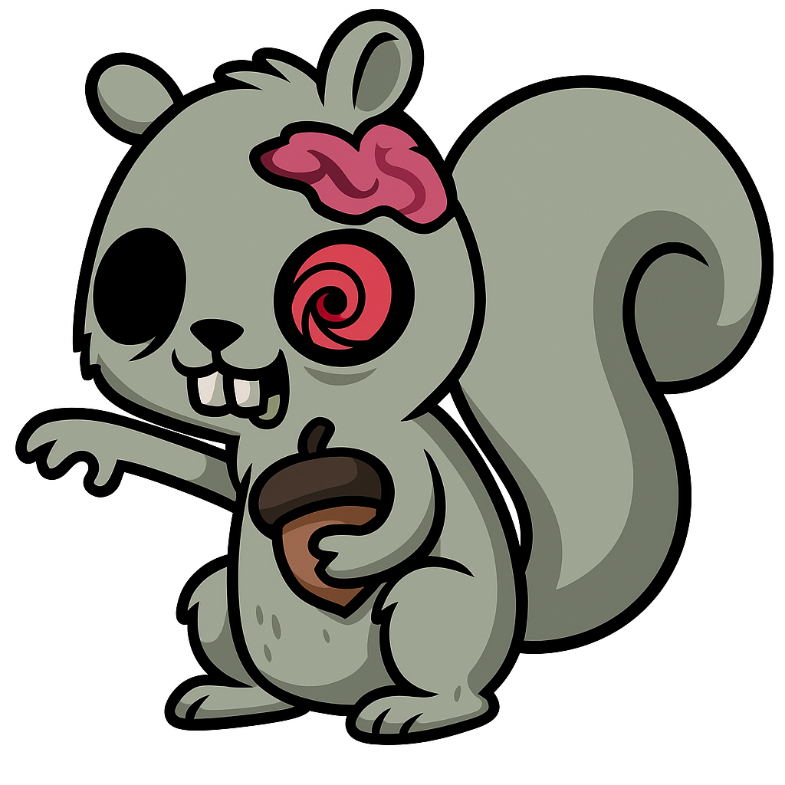

# ZOMBIE Squirrel

[](LICENSE)

[](https://github.com/semantic-release/semantic-release)




`zombie-squirrel` is a set of one-line functions that handle the entire process of caching and retrieving data (and metadata) from AIND data assets.

In the background, the ZOMBIE squirrel repackages data/metadata into dataframes and stores them on S3 in a flat bucket, or in memory for testing.

## Installation

```bash
pip install zombie-squirrel
```

## Usage

### Set backend

```bash
export FOREST_TYPE='S3'
```

Options are 'S3', 'MEMORY'.

### Scurry (fetch) data

```python
from zombie_squirrel import unique_project_names

project_names = unique_project_names()
```

| Function | Description | Parameters |
| -------- | ----------- | ---------- |
| `unique_project_names` | Fetch unique project names from docdb | |
| `unique_subject_ids` | Fetch unique subject IDs from docdb | |
| `asset_basics` | Fetch basic asset metadata including modalities, projects, and subject info | |
| `source_data` | Fetch source data references for derived records | |
| `raw_to_derived` | Fetch mapping of raw records to their derived records | |
| `qc` | Fetch QC dataframe for a single or multiple records | `str` or `list[str]` |

### Hide the acorns

```python
from zombie_squirrel.sync import hide_acorns
hide_acorns()
```
